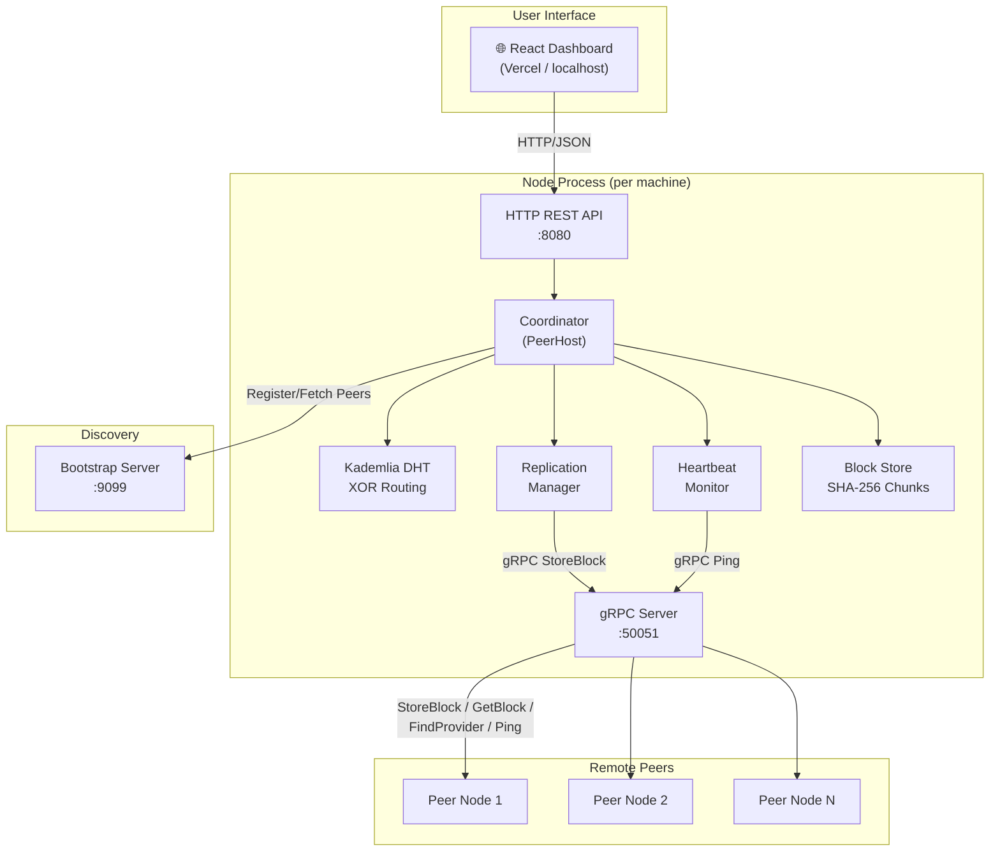

<div align="center">

# 🧩 Chunkster

### Peer-to-Peer Distributed File Storage System

[](https://go.dev)
[](https://grpc.io)
[](LICENSE)
[]()

*A fully decentralized, IPFS-inspired storage network built from scratch in Go.*
*Split files into content-addressed chunks, replicate them across peers, and retrieve them — even if the original uploader goes offline.*

</div>

---

## ✨ Features

| Feature | Description |
|---|---|
| **Content Addressing** | Every 256 KiB chunk is identified by its SHA-256 hash (CID). No filenames, no URLs — just cryptographic identity. |
| **Kademlia DHT Routing** | Nodes are organized using XOR distance metrics. Lookups converge in O(log N) hops, not brute force. |
| **Merkle DAG Integrity** | Files are represented as a tree of chunk hashes. Tampering with any single byte changes the root CID. |
| **Automatic Replication** | Each chunk is pushed to the 3 topologically closest peers via gRPC, surviving individual node failures. |
| **Self-Healing Network** | Dead peers are detected within 60 seconds by heartbeat monitors and evicted to make room for new nodes. |
| **Global Deployment** | Works over LAN (raw Wi-Fi IPs) or globally (Tailscale mesh + Ngrok HTTP tunnels). |
| **Real-Time Dashboard** | A React + Tailwind CSS frontend shows live Kademlia ring topology, peer registry, file catalog, and upload/download. |
| **20-Peer Bounded Network** | Enforces a hard cap of 20 active peers — demonstrating eviction, slot replacement, and capacity management. |

---

## 🏗️ Architecture



---

## 📂 Project Structure

```
├── cmd/
│   ├── bootstrap/       # Discovery server — the network "phone book"
│   └── node/            # Main storage node binary
├── internal/
│   ├── api/             # HTTP REST API (frontend ↔ node)
│   ├── coordinator/     # The brain — orchestrates all operations
│   ├── dht/             # Kademlia DHT: XOR distance, routing table, provider records, lookups
│   ├── gen/             # Auto-generated gRPC code (from proto/node.proto)
│   ├── heartbeat/       # Peer health monitoring (ping + timeout detection)
│   ├── merkle/          # Merkle DAG file tree structures
│   ├── network/         # gRPC connection pool and transport
│   ├── peer/            # Peer registry and lifecycle state management
│   ├── replication/     # Block replication with fallback recovery
│   ├── scheduler/       # Background cleanup and maintenance tasks
│   ├── storage/         # Block store, chunker, CID computation
│   └── utils/           # Shared constants and logger
├── proto/
│   └── node.proto       # gRPC service contract (8 RPC methods)
├── scripts/             # Cluster management shell scripts
├── docs/                # Detailed documentation
│   ├── ARCHITECTURE.md  # Full system design and algorithm breakdown
│   ├── DEPLOYMENT_GUIDE.md  # Step-by-step network setup commands
│   └── CONTRIBUTING.md  # Build instructions and contribution guidelines
├── Dockerfile           # Container definition (optional)
├── docker-compose.yml   # Multi-container setup (optional)
├── go.mod
└── go.sum
```

---

## 🚀 Quick Start

### Prerequisites

- [Go 1.21+](https://go.dev/dl/)
- Git Bash or any Unix-like terminal (on Windows)

### 1. Clone & Build

```bash
git clone https://github.com/Vara693/p2p-distributed-system-main.git
cd p2p-distributed-system-main

go build -o bin/bootstrap.exe ./cmd/bootstrap
go build -o bin/node.exe ./cmd/node
```

### 2. Start a Local Cluster

**Option A — Quick 3-node demo:**
```bash
sh ./scripts/start_cluster.sh
```

**Option B — Full 20-node stress test:**
```bash
sh ./scripts/start_20_nodes.sh
```

### 3. Stop the Cluster
```bash
sh ./scripts/stop_cluster.sh
```

### 4. Deploy Globally

For real-world deployment across the internet using Tailscale + Ngrok, see the complete **[Deployment Guide](docs/DEPLOYMENT_GUIDE.md)**.

---

## 🌐 Frontend Dashboard

The React web dashboard lives in a separate repository:

**🔗 [github.com/Vara693/p2p-distributed-system-frontend](https://github.com/Vara693/p2p-distributed-system-frontend.git)**

It connects to any running Chunkster node via its HTTP API and provides:
- Live Kademlia ring topology visualization
- Online systems registry with peer lifecycle states
- Drag-and-drop file upload with real-time CID generation
- CID-based file search and download
- Network health monitoring with 3-second polling

---

## 🛠️ Tech Stack

| Layer | Technology | Purpose |
|---|---|---|
| **Language** | Go 1.24 | All backend logic |
| **RPC Framework** | gRPC + Protobuf | High-performance node-to-node communication |
| **Serialization** | Protocol Buffers (proto3) | Network message definitions |
| **Codegen** | Buf | Compiles `.proto` → Go interfaces |
| **Frontend** | React 19 + Vite 8 | Real-time dashboard UI |
| **Styling** | Tailwind CSS 3 | Utility-first responsive design |
| **Icons** | Lucide React | Dashboard iconography |
| **Persistence** | Redis (optional) | Cloud-hosted bootstrap peer cache |
| **NAT Traversal** | Tailscale + Ngrok | Global peer mesh + HTTP tunneling |

---

## 📚 Documentation

| Document | Description |
|---|---|
| **[Architecture](docs/ARCHITECTURE.md)** | Complete system design — every folder, file, algorithm, and data structure explained |
| **[Deployment Guide](docs/DEPLOYMENT_GUIDE.md)** | Step-by-step commands for global (Tailscale+Ngrok) and LAN deployments |
| **[Contributing](docs/CONTRIBUTING.md)** | Build instructions, code style, and PR guidelines |

---

## 🧪 Testing Fault Tolerance

Run the integrated chaos simulation that proves bit-perfect file recovery after a node crash:

```bash
sh ./scripts/simulate_failure.sh
```

**What it does:**
1. Generates a random 1 MB test file
2. Uploads it → chunks are distributed to 3 replica peers
3. Kills a random replica node mid-session
4. Heartbeat detects the failure within 60 seconds
5. Downloads the file from surviving peers → verifies byte-for-byte integrity

---

## ⚖️ License

This project is licensed under the [MIT License](LICENSE).

---

<div align="center">
<sub>Built with ❤️ using Go, gRPC, and Kademlia DHT</sub>
</div>
